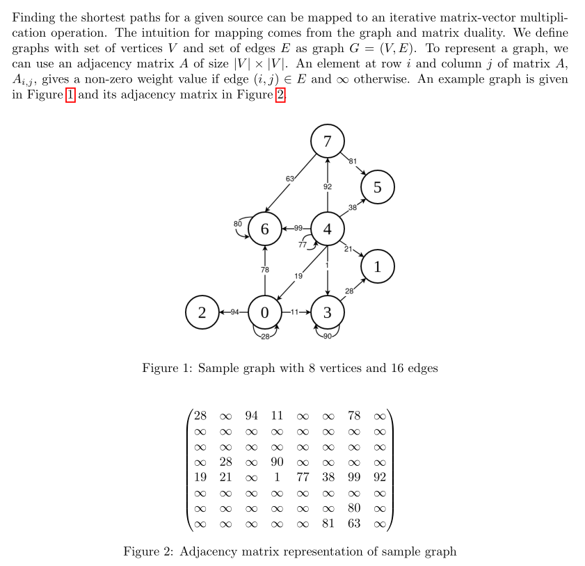
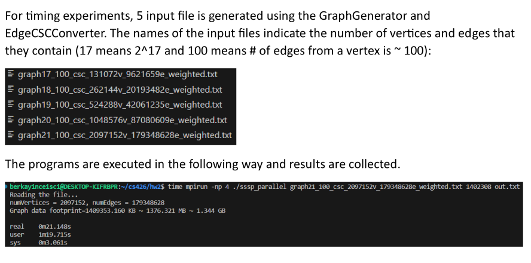
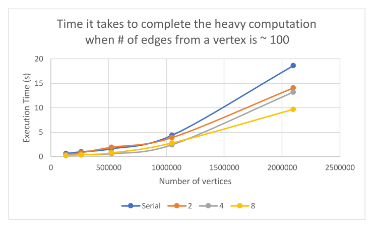

#### Problem Description


#### Results


> Above results clearly demonstrate that when the number of processes increases the time it takes to perform the heavy computation decreases.

#### Implementation Details
After MPI initialization, master process reads the input file and sends the number of vertices information to the worker processes. The number of vertices information is crucial for the computation part, and since it is read from the input file (and not from the command line), only the master process has that information. Therefore, master process should share it with other processes.Then the master process proceeds to partitioning the vertices, edges and weights arrays. Note that by the convention presented in the “util.h” file, vertices array is named as offsets. Vertices array is partitioned equally, and each process gets (num_vertices / numprocs + 1) number of elements from the vertices array. I used MPI_Scatterv() to partition the array to the processes, which allows distributing an array unequally to the processes. Even though vertices are distributed equally and therefore MPI_Scatter() could have been used instead, to be consistent with the way in which other arrays (edges and weights) are distributed (edges and weights are distributed unequally), I kept it as MPI_Scatterv(). MPI_Scatterv() takes three arrays as input, which are the array to be partitioned, send counts array and displacements array. These input arrays are ignored by calls to MPI_Scatterv() in worker processes, only the input arrays passed by the root process are taken into consideration. The resulting partitions can be accessed via another buffer passed into MPI_Scatterv(), in which case all processes can specify the number of elements they want to receive. Determining the number of elements to receive is simple in the case of vertices array, it is equal to (num_vertices / numprocs + 1) and the same for all of the processes. The buffer in which partitions of global vertices array are written is called local_vertices. The number of elements to be received from the partition of edges and weights array require an access to the local vertices array. In this case, the rcvsize is calculated by subtracting the first element of local_vertices array from the last element. After partitioning of three arrays (vertices, edges and weights) is performed, each process begins computation. In contrast to the serial implementation, each process now has access to the smaller parts of edges and weights array. Moreover, each process now computes only a part of R array, which requires indexing to be performed carefully. For those purposes, a displacement variable whose value is equal to the index of the beginning of the local edges and weights array is used. To construct array R in each process, only a part of the global D array should be accessed, which is achieved by constructing the index to global D array in the following way: ```D[i + process_id * (num_vertices / numprocs)]``` where ```0 <= i < num_vertices / numprocs``` After each process computes its local R array, they gather all computed R arrays into the global array D. This is achieved via MPI_Allgather(), which constructs a global D array from the local R arrays computed by the processes. Each process passes its local R as input, and the result is written to the global D array passed as buffer to the function. The early termination logic is implemented using MPI_Allreduce(). In this case, each process has a flag variable called “changed”, which is set to 1 if any value of local R is changed during iteration. At the end of each iteration MPI_Allreduce() is called, which computes the sum of “changed” values. If it is equal to 0, it means none of the local R arrays underwent a change, and the loop is terminated (the value of “changed” is set to 0 if the sum is equal to 0, and at the beginning of each loop iteration, the value of “changed” is checked. After local computations are done, global D array holds the result, which is outputted by the master process.
